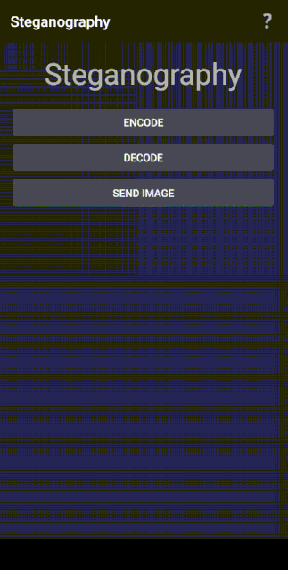

# BreadcrumbsImage-Steganography

## Concept

Steganography is the practice of concealing a message, image, or file within another message, image, or file. Unlike cryptography, which focuses on encrypting the content of a message, steganography hides the existence of the message itself. This can be achieved by embedding the message within a carrier medium, such as an image or audio file, in a way that is not readily apparent to an observer.

## Project Overview

This project is an Android application that implements steganography to encode and decode messages within images. The application allows users to select an image from their device, enter a message to encode, and then encode the message within the selected image. The encoded image can then be shared or saved to the device.

## Encoding Process

The encoding process in this project involves the following steps:

1. **Selecting an Image**: The user selects an image from their device's gallery using the application.

2. **Converting the Message to Binary**: The message entered by the user is converted into binary format. Each character in the message is represented by its corresponding ASCII value, which is then converted into an 8-bit binary representation.

3. **Embedding the Message in the Image**: The binary representation of the message is embedded into the least significant bits (LSBs) of the pixel values in the selected image. This is done by iterating over each pixel in the image and modifying the LSBs of the color channels (e.g., red, green, blue) to match the binary representation of the message. Since the changes made to the LSBs are minimal, they are not visually perceptible to the human eye, allowing the message to be hidden within the image.

4. **Saving the Encoded Image**: Once the message has been successfully encoded into the image, the user has the option to save the encoded image to their device's storage.

## Project Preview

## How to Use

1. Open the application on your Android device.
2. Select an image from your device's gallery.
3. Enter the message you want to encode.
4. Tap the "Encode" button to encode the message within the image.
5. The encoded image will be displayed, and you can choose to save or share it.

## Notes

- Make sure to select an image with sufficient color depth and resolution to ensure effective encoding without noticeable degradation in image quality.
- This application is for educational purposes only and should not be used for illegal or unethical activities.

## Credits

This project was developed by [Your Name] as part of a learning exercise in mobile application development.

## License

This project is licensed under the [insert license type] license.
